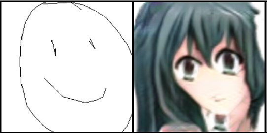
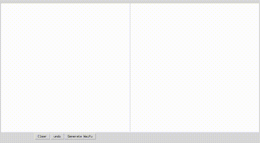

# animeGAN
a silly project to draw some waifus with deep learning

## The model

This is an application of cycleGAN for style transfer of crude sketches into anime images. The model was trained with the [official
repo](https://github.com/junyanz/pytorch-CycleGAN-and-pix2pix) put out by the researchers who published it.

This repo includes the barebones needed to run the model from that repository

## The Data

The anime data is from this [repository](https://github.com/Mckinsey666/Anime-Face-Dataset)

The sketches come from Google's [QuickDraw! dataset](https://storage.cloud.google.com/quickdraw_dataset/full/simplified/), harvested from an online pictionary type game.

## animeGAN in action

# What's in this repo?
+ `cyclegan` includes all the code needed for inference but not training (does not include a discriminator)
+ `data` contains all the scripts you need to get and convert the data from `.ndjson` (n-dimensional json. Basically a list of `.json` objects) to images you can train on
+ `drawmywaifu.py` will open the above interface

## Requirements
Pytorch == 0.4 (I think more recent versions will work too, but I used 0.4) 

## Notes/further improvement
CycleGAN's improvement over previous GANs was that it trains two style transfer networks for translation from either style domain
to the other. It then optimizes towards "cycle consistency". That is, if we have networks F: A -> B and G: B -> A, we want it to be the case that for any image X, X=G(F(X))

The problem in this project was that the second network often deteriorates to predicting blank sketches from anime images. This
makes sense: given that the images are mostly whitespace predicting all whitespace is never a bad guess under most metrics.

What this means I think is the discriminator is slacking off so I should either up the model complexity there and/or play with its
hyper parameters.

Another thing I should do is retrain the network, but treat the input and output sketches as one channel images (which they are). For
simplicity I just decided to treat them as RGB images, but there's no need to complicate the problem and add unnessescary size
to the network.

Also, the network always predicts images that are the same colors. I think this is because the input images are always black and white. Adding
some random noise at train time and inference time could fix this.

In conclusion, GANs are hard to train and I may come back to this if I can somehow justify using my GPU to make anime faces instead of any of my other projects.
